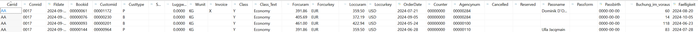

# ABAP CDS

**Datumsfunktionen** 
 
Erweitere den View ZI_Buchung[xx] 
 
Füge ein neues Feld ein Buchung_im_Voraus für die Anzahl Tage zwischen OrderDate und Fldate 
 
Füge ein neues Feld ein Faelligkeit für 30 Tage nach OrderDate 

