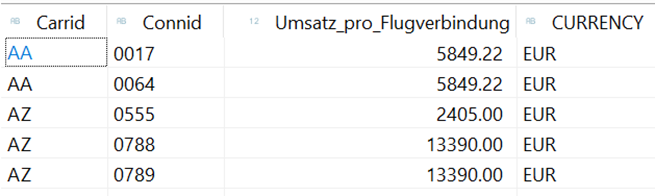
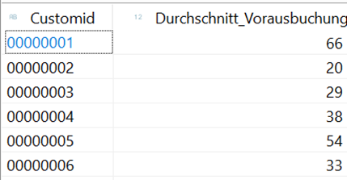

# ABAP CDS

**Aggregationen und View on View** 
 
Erstelle einen View ZI_Umsatz_pro_Flug[xx] basiernd auf dem View ZI_Flug[xx] 
 
Aggregiere auf die Summe des Preises in Euro 
Nur Gesellschaft und Verbindung sind interessant 

 
 
Basieren auf ZI_BUCHUNG[xx] 
Aggregiere in einem Hilfsview ZP_Kundenbuchung[xx] die durchschnittliche Anzahl der Tage die ein Kunde im Voraus gebucht hat 
Runde das Ergebnis in ZI_Kundenbuchung basieren auf dem Hilfsview in auf den nächsten vollen Tag 
 
Achtung: View Entity würden auch ohne Hilfsview auskommen, die obsoleten View nicht 
 
Für die Verdichtung ist nur der Kunde interessant 

 
 
 
Hilfe: avg(Buchung_im_voraus as abap.dec(12,2)) 
AVG wirft eine Fehlermeldung bei VIEW Entity, wenn kein Casting erfolgt AVG(Field as ...) 
https://help.sap.com/doc/abapdocu_cp_index_htm/CLOUD/en-US/ABENCDS_AVG_AS_V1.html

