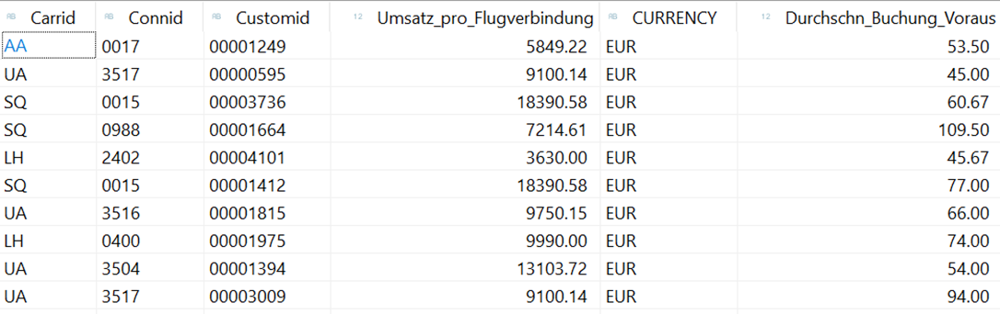

# ABAP CDS

**Join** 
 
Erstelle einen View ZI_Umsatz_Kundenverhalten[xx] auf dem View ZI_Buchung[xx] und ZI_Umsatz_pro_Flug[xx] 
 
Auf den Flügen mit dem meisten Umsatz, wie ist das durchschnittliche Buchungsverhalten der Kunden?  
 
Verbinde die beiden CDS-Views über CARRID und CONNID 
 
Verdichte die durchschnittlichen Vorausbuchung über CARRID und CONNID und den Umsatz 
