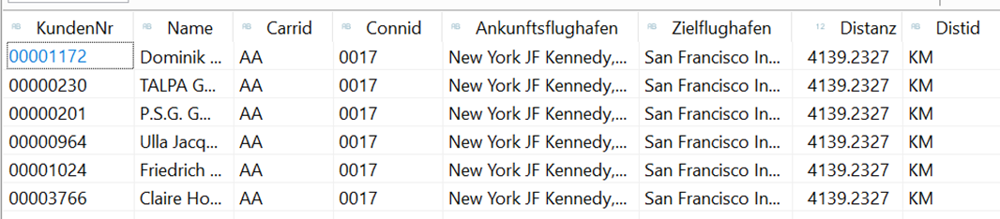

# ABAP CDS

**Left outer und geschachtelte Joins** 
 
Erstelle einen View ZI_AIRPORT[xx] basierend auf der Tabelle SAIRPORT 
Warum kann der View nicht einfach aktiviert werden? 
 
Erstelle einen View ZI_Kunden_Fluege[xx] auf dem View ZI_Kunde[xx], ZI_Buchung[xx], ZI_FLUGPLAN[xx], ZI_AIRPORT[xx] 
 
Zeigen alle Kunde mit Klartextname und Kundennumer mit ihren Flügen. 
 
Zeige auch Kunden, die keine Flüge haben 
 
Zeige zu einem Flug Abflug- und Zielflughafen als Klartextname mit der Distanz in KM 

