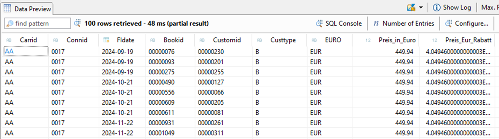

# ABAP CDS

**Union** 
 
Erstelle einen View ZI_Buchung_Rabatt[xx] basierend auf ZI_Kunde[xx], ZI_Flug[xx] und ZI_Buchung[xx] 
 
Geschäftskunden vom Typ B (Custtype) bekommen einen Rabatt von 10% 
 
Verknüpfe die Kunde mit den Buchungen per Join  
Rückgabe sind die Schlüsselfelder der Buchung, der Kunde mit Name und der Preis des Fluges und der Preis in Euro mit neuem Rabatt_Feld 
 
Führe diesen Join getrennt für die Typen P und B durch 
 
Führe Kunden vom Typ P und Typ B dann in der Ergebnismenge zusammen per Union 
 

