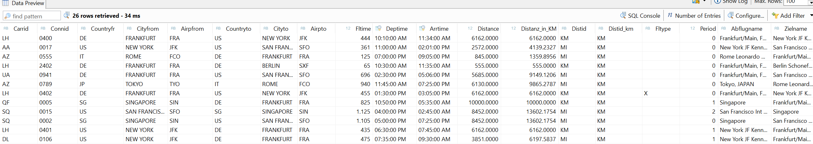

# ABAP CDS Fortgeschrittene Konzepte

**Erweiterung eines CDS View** 
 
Erstelle die Erweiterung ZI_FLUG_ROUT_KOMPL[xx] basieren auf dem View ZI_FLUGPLAN[xx] 
 
Führe zusätzliche Assoziationen auf ZI_Airport[xx] ein, jeweils für Abflug- und Zielflughafen 
Exponiere die beiden Assoziationen in der Feldliste 
 
 
Prüfe den View ZI_FLUGPLAN[xx] im Data Preview und folge dem Pfad zu den Klartextnamen der Flughäfen 
 
